# VCF 9.1 HCX Mobility Group Builder Toolkit

A PowerShell 7 and WPF application for discovering workloads, validating destination configuration, scheduling cutover windows, and creating VMware HCX 9.1 Mobility Group drafts. The toolkit is designed for a controlled workflow in VMware Cloud Foundation 9 environments and does not start migrations.

> **Current release:** Rev 3.4  
> **Primary script:** `VCF_9_1_HCX_Mobility_Group_Builder_Toolkit_Rev_3.4.ps1`  
> **Runtime:** Windows, PowerShell 7, STA, WPF, VCF.PowerCLI

## Highlights

- Connects to HCX Manager, source vCenter, and destination vCenter.
- Discovers HCX topology, migration direction, Service Mesh, networks, storage, compute, folders, and storage policies.
- Imports VMs by name with optional Mobility Group numbers.
- Matches VM names case-insensitively.
- Detects source VM power state and vTPM configuration.
- Highlights missing and powered-off workloads for operator review.
- Supports exact-name network matching, network-mapping CSV input, and per-VM overrides.
- Supports HCX Assisted vMotion, HCX vMotion, Replication-assisted vMotion, Bulk Migration, Cold Migration, and OS Assisted Migration when returned by HCX.
- Provides per-group Transfer and Switchover scheduling with calendar controls and Scheduler CSV import.
- Preserves validated Scheduler state when the current VM list is moved to Save and Create.
- Builds one payload per populated Mobility Group and creates HCX drafts sequentially.
- Validates that `transferProfile` and `switchoverProfile` remain JSON arrays.
- Stores logs, transcripts, REST evidence, payloads, responses, and placement audits in a timestamped run folder.
- Uses themed inventory, validation, and completion dialogs consistent with the main application.

## Architecture and Flow

The Mermaid sequence diagram is intentionally rendered as a true sequence diagram. The fenced `mermaid` block is required for GitHub to render the diagram rather than displaying unformatted text.

```mermaid
sequenceDiagram
    autonumber
    actor Admin as Migration Administrator
    participant Tool as HCX Builder
    participant HCX as HCX Manager 9.1
    participant Src as Source vCenter
    participant Dst as Destination vCenter
    participant Evidence as Run Evidence

    rect rgb(20, 35, 45)
        Note over Admin,Evidence: Connect and discover
        Admin->>Tool: Launch PowerShell 7 WPF application
        Tool->>Evidence: Create timestamped run folder and logs
        Admin->>Tool: Enter or load connection profile
        Tool->>HCX: Authenticate and discover topology
        Tool->>Src: Connect and retrieve source inventory
        Tool->>Dst: Connect and retrieve destination inventory
        HCX-->>Tool: Direction, site pair, Service Mesh, migration types
        Src-->>Tool: VMs, power state, vTPM, NICs, source placement
        Dst-->>Tool: Networks, compute, storage, folders, policies
    end

    rect rgb(18, 45, 58)
        Note over Admin,Evidence: Prepare VM list and destination configuration
        Admin->>Tool: Import VM CSV
        loop Each imported VM
            Tool->>Src: Resolve VM name and inspect inventory
            Src-->>Tool: VM, vTPM, NIC, power, and placement data
            Tool->>Tool: Match destination networks and apply defaults
        end
        Tool->>Evidence: Save VM inventory findings CSV
        Tool-->>Admin: Display themed VM Import Summary
        Admin->>Tool: Review highlighted rows and destination settings
        Admin->>Tool: Validate configuration
    end

    rect rgb(26, 50, 43)
        Note over Admin,Evidence: Configure schedules
        Admin->>Tool: Configure schedules or import Scheduler CSV
        Tool->>Tool: Apply migration-type scheduling rules
        Admin->>Tool: Validate Schedules
        Tool->>Tool: Convert dates and times to epoch milliseconds
        Tool-->>Admin: Scheduler Pass or detailed findings
    end

    rect rgb(40, 38, 58)
        Note over Admin,Evidence: Build and create HCX drafts
        Admin->>Tool: Use Current VM List
        Admin->>Tool: Validate Mobility Groups
        Admin->>Tool: Preview payloads
        loop Each populated Mobility Group
            Tool->>Src: Re-read current VM and NIC details
            Tool->>Tool: Build and normalize HCX payload
            Tool->>Evidence: Save payload and placement audit
        end
        Admin->>Tool: Create Mobility Group Drafts in HCX
        Tool->>HCX: Refresh authentication
        loop Each validated payload
            Tool->>Tool: Assert JSON collection contract
            Tool->>HCX: POST Mobility Group draft
            HCX-->>Tool: Draft ID and migration IDs
            Tool->>Evidence: Save request and response
        end
        Tool-->>Admin: Display themed creation summary
        Admin->>HCX: Review drafts before manual execution
    end
```



## Requirements

- Windows workstation with an interactive desktop.
- PowerShell 7 or later running in STA mode.
- VCF.PowerCLI.
- HTTPS connectivity to HCX Manager and both vCenter systems.
- Read access to source and destination inventories.
- Permission to create HCX Mobility Group drafts.
- Write access to the output directory.

## Launch

```powershell
Set-Location C:\Script

pwsh.exe -NoProfile -ExecutionPolicy Bypass -STA `
  -File '.\VCF_9_1_HCX_Mobility_Group_Builder_Toolkit_Rev_3.4-Themed-Dialogs-and-Policy-Stability.ps1'
```

## Quick Start

1. Enter or load the HCX and vCenter connection details.
2. Select **Connect and Load Inventory**.
3. Import the VM CSV.
4. Review highlighted missing or powered-off VM rows.
5. Configure network, destination, and storage settings.
6. Validate the VM configuration.
7. Configure schedules manually or import a Scheduler CSV.
8. Select **Validate Schedules** and confirm **Scheduler: Pass**.
9. Open **Save and Create**, then select **Use Current VM List**.
10. Validate the configuration and Mobility Groups.
11. Preview payloads.
12. Create Mobility Group drafts in HCX.
13. Review every draft in HCX Manager before manually starting migration activity.

## Input Examples

### VM import CSV

```csv
VMName,MobilityGroupNumber
appserver01,1
secureapp01,2
```

### Network mapping CSV

```csv
SourceNetworkName,DestinationNetworkName
Legacy-App-Network,New-App-Network
Legacy-Database-Network,New-Database-Network
```

### Scheduler CSV

```csv
MobilityGroupNumber,TransferMode,TransferStartDate,TransferStartTime,TransferExpiryDate,TransferExpiryTime,SwitchoverMode,SwitchoverStartDate,SwitchoverStartTime,SwitchoverEndDate,SwitchoverEndTime
1,Not Applicable,,,,,Set Switchover Schedule,2026-09-20,21:00,2026-09-21,01:00
2,Set Transfer Schedule,2026-09-20,18:00,2026-09-21,06:00,Set Switchover Schedule,2026-09-21,21:00,2026-09-22,01:00
```

Accepted date formats are `yyyy-MM-dd`, `M/d/yyyy`, and `MM/dd/yyyy`. Times use 24-hour `HH:mm` format. Transfer fields are ignored when the selected migration type does not support Transfer scheduling.

## Safety Model

- The toolkit creates drafts only.
- **No Transfer Schedule** writes an empty Transfer schedule and does not start migration activity.
- The application does not select **Run** in HCX Manager.
- Passwords are not written to profile JSON, CSV, payload, or intended audit output.
- Scheduler, placement, network, policy, and JSON collection checks run before submission.
- Drafts should be reviewed in HCX Manager before execution.

## Evidence

Each launch creates a folder similar to:

```text
HCX91-MobilityCSV-Run-YYYYMMDD-HHMMSS
```

Typical contents include:

```text
HCX91-MobilityCSV-*.log
HCX91-PowerShell-Transcript-*.log
HCX91-VM-Import-Inventory-Findings-*.csv
HCX91-Host-StoragePod-Audit-*.json
HCX91-<Group>-Payload.json
HCX91-<Group>-Request.json
HCX91-<Group>-Response.json
Debug-Artifacts\*.json
```

## Repository Layout

```text
/
├── VCF_9_1_HCX_Mobility_Group_Builder_Toolkit_Rev_3.4-Themed-Dialogs-and-Policy-Stability.ps1
├── README.md
├── Wiki.md
├── examples/
│   ├── vm-import.example.csv
│   ├── network-mapping.example.csv
│   └── scheduler-import.example.csv
└── screenshots/
    ├── vm-import-summary.png
    ├── scheduler.png
    └── mobility-group-completion.png
```

## Current Release Notes

Rev 3.4 includes the complete HCX 9.1 migration-type inventory, per-group Scheduler controls, Scheduler CSV import, validated Scheduler-state preservation, JSON array enforcement for Transfer and Switchover profiles, missing and powered-off VM highlighting, expanded connection-state display, deterministic storage-policy restoration, and themed inventory and completion dialogs.

