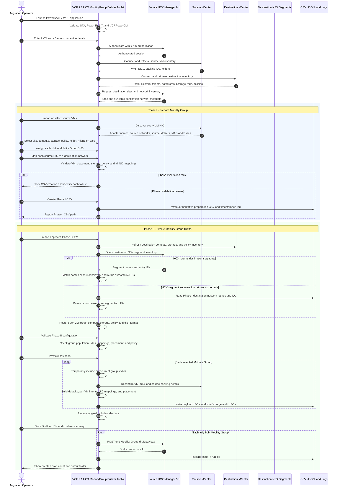
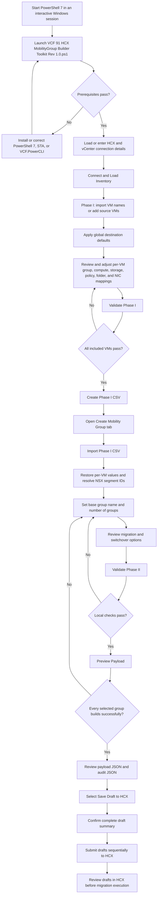

# VCF 9.1 HCX MobilityGroup Builder Toolkit Rev 1.0

> Operator-focused PowerShell 7 and WPF toolkit for preparing, validating, previewing, and saving VMware HCX 9.1 Mobility Group draft payloads from a controlled two-phase workflow.

**Primary script:** `VCF 91 HCX MobilityGroup Builder Toolkit Rev 1.0.ps1`  
**Target platform:** VMware Cloud Foundation 9 with HCX 9.1  
**Execution environment:** Windows PowerShell 7 in an interactive STA desktop session  
**Primary interfaces:** HCX REST API, source vCenter, destination vCenter, PowerCLI, SPBM storage policy inventory  
**Operational model:** Phase I creates an authoritative preparation CSV; Phase II imports that CSV, preserves per-VM placement, builds one or more Mobility Group payloads, and saves HCX drafts only after validation.

---

## Contents

- [Purpose](#purpose)
- [Key Capabilities](#key-capabilities)
- [Architecture](#architecture)
- [End-to-End Workflow](#end-to-end-workflow)
- [Requirements](#requirements)
- [Installation](#installation)
- [Phase I: Prepare Mobility Group](#phase-i-prepare-mobility-group)
- [Phase II: Create Mobility Group](#phase-ii-create-mobility-group)
- [Phase I CSV Contract](#phase-i-csv-contract)
- [Placement and Network Rules](#placement-and-network-rules)
- [Payload Preview and HCX Draft Creation](#payload-preview-and-hcx-draft-creation)
- [Logging and Evidence](#logging-and-evidence)
- [Troubleshooting](#troubleshooting)
- [Security and Change Control](#security-and-change-control)
- [Release Notes](#release-notes)

---

## Purpose

`VCF 91 HCX MobilityGroup Builder Toolkit Rev 1.0.ps1` provides a structured operator workflow for building HCX 9.1 Mobility Groups without requiring administrators to manually construct JSON payloads or repeatedly enter the same placement data. The toolkit separates preparation from draft creation so destination choices can be reviewed, exported, imported, validated, and audited before an HCX draft is saved.

The toolkit is designed for migrations that require:

- One or more source virtual machines.
- One or more Mobility Groups, from 1 through 50.
- Per-VM Mobility Group assignment.
- Destination host or cluster placement.
- Destination datastore or datastore-cluster placement.
- Destination storage policy selection.
- Destination VM folder selection.
- Per-vNIC source-to-destination network mappings.
- HCX NSX segment identifiers in `/infra/segments/<segment>` form.
- Payload preview before HCX draft creation.
- Sequential creation of HCX drafts after all local payloads build successfully.
- Timestamped logs and JSON audit evidence.

The toolkit creates HCX **drafts**. Saving a draft does not itself start the migration. Operators must review the resulting draft in HCX and follow the approved change process before starting migration activity.

---

## Key Capabilities

### Phase I preparation

- Connects to the source HCX Manager.
- Connects to source and destination vCenter instances.
- Loads source VM inventory.
- Loads destination networks.
- Loads destination hosts and clusters.
- Loads destination datastores and datastore clusters.
- Loads destination VM folders.
- Loads destination SPBM storage policies.
- Supports global destination defaults.
- Supports per-VM overrides.
- Discovers all NICs for each selected VM.
- Requires a destination mapping for each NIC.
- Validates every included VM independently.
- Exports a preparation CSV only after Phase I validation passes.

### Phase II draft construction

- Imports the Phase I CSV.
- Restores the selected host or cluster for each VM.
- Restores the selected datastore or datastore cluster for each VM.
- Restores destination storage policy and disk format.
- Restores Mobility Group numbers.
- Preserves authoritative NSX segment IDs from Phase I.
- Supports 1 through 50 sequential Mobility Group payloads.
- Previews payload JSON before creation.
- Normalizes vCenter managed object identifiers.
- Audits group-default and per-VM compute and storage placement.
- Saves HCX drafts one at a time only after all selected groups build successfully.

### Safety controls

- PowerShell 7 prerequisite validation.
- STA/WPF validation.
- VCF.PowerCLI prerequisite validation.
- HCX authentication validation.
- Password masking in the interface.
- Connection profile export without passwords.
- Fail-closed Phase I validation.
- Fail-closed Phase II local checks.
- Explicit confirmation before HCX draft creation.
- Payload preview separated from HCX save.
- Original Include states restored after multi-group payload generation.
- Security-tag replication defaults to unchecked.

---

## Architecture

The toolkit uses a two-phase control boundary:

1. **Phase I** collects authoritative source and destination selections and exports them to CSV.
2. **Phase II** imports the approved CSV, retains per-VM selections, performs local validation, builds payloads, and submits HCX drafts sequentially.

### Mermaid wire workflow



---

## End-to-End Workflow



---

## Requirements

### Workstation and PowerShell

- A supported Windows desktop or administrative workstation with an interactive user session.
- PowerShell 7 or later.
- WPF support.
- STA execution for the WPF interface.
- VCF.PowerCLI installed and discoverable.
- Write access to the script directory or configured output base path.

### Connectivity

The automation host must be able to reach:

- Source HCX Manager over HTTPS.
- Source vCenter over HTTPS.
- Destination vCenter over HTTPS.
- Any supporting name-resolution infrastructure required for the configured FQDNs.

### Accounts and permissions

The operator requires credentials that can:

- Authenticate to HCX.
- Read HCX sites, service mesh, network, and Mobility Group resources used by the script.
- Create Mobility Group drafts when the save operation is selected.
- Connect to the source vCenter and read VMs, VM views, NICs, and disks.
- Connect to the destination vCenter and read hosts, clusters, folders, datastores, datastore clusters, and storage policies.

The toolkit does not export passwords in the connection-profile JSON.

---

## Installation

1. Copy `VCF 91 HCX MobilityGroup Builder Toolkit Rev 1.0.ps1` to an approved automation directory.
2. Retain the prior revision before replacing the script.
3. Open PowerShell 7 in an interactive Windows session.
4. Change to the script directory.
5. Run the script according to the organization's execution-policy and code-signing requirements.

Example:

```powershell
Set-Location C:\Script

pwsh.exe -NoProfile -ExecutionPolicy Bypass -File ".\VCF 91 HCX MobilityGroup Builder Toolkit Rev 1.0.ps1"
```

The script includes self-signing support for environments that permit locally generated code-signing certificates. Organizations with enterprise code-signing controls should sign the script through the approved internal process instead.

---

## Phase I: Prepare Mobility Group

### 1. Verify prerequisites

Confirm the prerequisite area reports:

- PowerShell version detected.
- STA available.
- VCF.PowerCLI found.
- HCX API authenticated after connection.

### 2. Enter connection details

Provide:

- Source HCX Manager.
- HCX username and password.
- Source vCenter.
- Source vCenter username and password.
- Destination vCenter.
- Destination vCenter username and password.
- Whether the source HCX Manager value should be reused where supported by the interface.

Select **Connect and Load Inventory**.

### 3. Verify inventory counts

Review the log for successful retrieval of:

- Source VMs.
- Destination networks.
- Destination datastores.
- Destination datastore clusters.
- Destination storage policies.
- Destination compute inventory.
- Destination VM folders.

A datastore cluster is represented with:

```text
Type: storagepod
ID: group-p<integer>
```

A destination host is represented with:

```text
Type: host
ID: host-<integer>
```

A destination cluster is represented with:

```text
Type: cluster
ID: domain-c<integer>
```

### 4. Import or add source VMs

Use the Phase I import function to load VM names from a source CSV. The toolkit enriches each VM with source vCenter data and discovers all network adapters.

Each included VM appears as an independent row. Operators can remove rows, clear the list, or refresh inventory before validation.

### 5. Apply global destination settings

Phase I Global Destination Settings include:

- Destination Site.
- Compute.
- Datastore or Datastore Cluster.
- Storage Policy.
- Folder.
- Migration Type.

Select **Apply to All VMs** to apply the current global values to all rows. After applying defaults, review every VM row and adjust exceptions directly in the grid.

### 6. Assign Mobility Group numbers

Assign each VM a `MobilityGroupNumber` from 1 through 50. Group numbers drive the Phase II split operation.

Recommended practice:

- Use contiguous group numbers beginning with 1.
- Avoid selecting a group count larger than the highest populated group.
- Confirm each intended group has at least one included VM.
- Group VMs according to application dependency, maintenance window, network requirements, and cutover sequencing.

### 7. Review compute and storage placement

For each VM, confirm:

- Destination compute name.
- Destination compute ID.
- Destination compute type.
- Destination datastore or datastore-cluster name.
- Destination storage ID.
- Destination storage type.
- Storage policy.
- Disk format.
- Destination folder.

### 8. Review network mappings

The toolkit validates every discovered network adapter independently. Each adapter requires:

- Source adapter name.
- Source network name.
- Source backing identifier.
- Destination network name.
- Destination network identifier.
- Destination network type.

The authoritative destination NSX identifier should use:

```text
/infra/segments/<segment-id>
```

### 9. Validate Phase I

Select **Validate**. CSV creation remains blocked until every included VM passes.

Validation covers:

- VM identity.
- Destination site.
- Compute selection and type.
- Storage selection and type.
- Storage policy.
- VM folder.
- Migration type.
- Mobility Group number.
- Every NIC mapping.

### 10. Create the Phase I CSV

Select **Create Phase I CSV** after validation passes. The CSV becomes the handoff contract for Phase II.

The CSV should be treated as controlled migration input. Preserve it with the run log and approval evidence.

---

## Phase II: Create Mobility Group

### 1. Import the Phase I CSV

Open the **Create Mobility Group** tab and select **Import CSV**.

The import process restores:

- VM name and ID.
- Include state.
- Mobility Group number.
- Compute name, ID, and type.
- Folder name and ID.
- Storage name, ID, and type.
- Storage policy.
- Disk format.
- Network mappings.
- HCX Manager and destination site values available in the CSV.

### 2. Review group settings

Set:

- Base Group Name.
- Number of Groups from 1 through 50.
- Source Site.
- Destination Site.

The toolkit adds a two-digit suffix for generated group names:

```text
<Base Group Name>-01
<Base Group Name>-02
<Base Group Name>-03
```

### 3. Review destination settings

Phase II global destination settings remain available for intentional bulk changes. Import does not intentionally replace the per-VM compute and storage values carried from Phase I.

Review:

- Destination Site.
- Compute.
- Storage.
- Storage Policy.
- Disk Format.

Use the Phase II apply function only when a deliberate bulk override is required.

### 4. Review migration settings

The interface exposes migration and switchover choices, including:

- Retain MAC.
- Upgrade virtual hardware.
- Upgrade VMware Tools.
- Migrate custom attributes.
- Migrate vCenter tags.
- Remove mounted ISOs where enabled by the script option.
- Replicate security tags, unchecked by default.
- Start after transfer is complete.
- Set switchover schedule.
- Defer switchover.

Review these values against the approved migration design before saving drafts.

### 5. Validate Phase II

Phase II validation checks:

- HCX connection state.
- Imported rows.
- Base Group Name.
- Group count.
- At least one originally included VM in every selected group.
- Source Site.
- Destination Site.
- At least one included VM.
- Destination NSX segment identifiers.

### 6. Preview payloads

Select **Preview Payload** before saving drafts. Preview builds every group locally and writes payload JSON without creating HCX drafts.

The multi-group builder:

1. Captures the original Include state.
2. Selects the original members of Group 1.
3. Temporarily includes only Group 1 members.
4. Builds and normalizes Group 1.
5. Repeats for every configured group.
6. Restores the original Include state in a `finally` block.

If any group fails to build, no HCX drafts are submitted by the save workflow because payload construction must complete first.

### 7. Save drafts to HCX

Select **Save Draft to HCX** only after preview succeeds and the JSON artifacts have been reviewed.

The toolkit displays a summary and requests confirmation. After confirmation, drafts are submitted to HCX one at a time.

---

## Phase I CSV Contract

The exact exported header is generated by the script, but the principal fields include:

- `VMName`
- `VMId`
- `ValidationStatus`
- `HCXManager`
- `DestinationSite`
- `DestinationCompute`
- `DestinationComputeId`
- `DestinationComputeType`
- `DestinationFolder`
- `DestinationFolderId`
- `DestinationDatastore`
- `DestinationDatastoreId`
- `DestinationStorageType`
- `DestinationStoragePolicy`
- `MigrationType`
- `MobilityGroupNumber`
- `DestinationNetworkMappingsJson`

### Network mappings JSON

`DestinationNetworkMappingsJson` contains one object per VM NIC. The objects preserve the source network and destination network information required by Phase II.

Conceptual example:

```json
[
  {
    "AdapterName": "Network adapter 1",
    "SourceNetworkName": "Application-Network",
    "SourceNetworkId": "dvportgroup-1234",
    "DestinationNetworkName": "Application-Segment",
    "DestinationNetworkId": "/infra/segments/Application-Segment",
    "DestinationNetworkType": "NsxtSegment"
  }
]
```

Do not manually remove the destination network ID. Phase II uses the authoritative `/infra/segments/...` path when HCX network enumeration does not return the segment list.

---

## Placement and Network Rules

### Compute

Supported destination compute types:

- Host: `host-<integer>`
- Cluster: `domain-c<integer>`

The payload normalizer removes wrapper prefixes when necessary and verifies the resulting identifier shape.

### Storage

Supported destination storage types:

- Datastore: `datastore-<integer>`
- Datastore cluster: `group-p<integer>` with payload type `storagepod`

Storage is normally represented as a group default. Per-VM migration intents can inherit that default without carrying their own `storage` property.

### Storage policy

Phase I retrieves SPBM storage policies from the destination vCenter. The selected policy is exported and restored in Phase II. The payload includes a `StorageProfile` storage parameter.

For encrypted or vTPM-enabled VMs, select a storage policy approved for the workload's encryption requirements.

### Networks

Phase II first attempts HCX destination segment discovery. If the HCX query returns no segment records, the toolkit retains the Phase I mappings and normalizes destination identifiers to:

```text
/infra/segments/<segment-id>
```

Payload construction can use a retained authoritative destination ID directly.

---

## Payload Preview and HCX Draft Creation

### Preview artifacts

Preview writes one payload file for each Mobility Group. The naming pattern includes the generated group name:

```text
HCX91-<Mobility-Group-Name>-Payload.json
```

### Placement audit

The tool writes a timestamped host and datastore-cluster audit file:

```text
HCX91-Host-StoragePod-Audit-YYYYMMDD-HHMMSS-fff.json
```

The audit records:

- Mobility Group.
- VM.
- Category, compute or storage.
- Scope, such as GroupDefault, PerVMOverride, or InheritedGroupDefault.
- Name.
- Type.
- Original ID.
- Normalized ID.
- Effective ID.
- Whether normalization changed the ID.
- Storage profile.
- Disk provisioning type.

### Save behavior

The save workflow builds the complete payload list before submitting any draft. This prevents a local Group 2 or Group 3 build failure from creating only Group 1 in HCX.

After all groups build, the toolkit asks for confirmation and submits drafts sequentially.

---

## Logging and Evidence

Each run creates a timestamped output directory. The UI log and file log use these levels:

- `INFO`
- `WARN`
- `ERROR`
- `PASS`

Evidence can include:

- Phase I preparation CSV.
- Phase II payload JSON files.
- Host and storage placement audit JSON.
- Timestamped operational log.
- Compute-ID normalization audit.
- HCX draft-creation responses or identifiers where returned by the API.

Recommended archival set:

```text
VCF 91 HCX MobilityGroup Builder Toolkit Rev 1.0.ps1
Phase I CSV
Connection profile without passwords
Payload JSON files
Placement audit JSON files
Run log
Change record reference
HCX validation screenshots
```

---

## Troubleshooting

### HCX authentication fails

- Confirm the HCX Manager address.
- Confirm TCP 443 reachability.
- Re-enter the HCX username and password.
- Confirm the account can authenticate to the HCX API.
- Review the UI log for the attempted authentication paths.

### Destination datastore cluster is missing

- Confirm destination vCenter connectivity.
- Confirm the account can read `StoragePod` views.
- Review the log for `Destination datastore-cluster inventory loaded`.
- A datastore cluster must have a `group-p<integer>` managed object reference.

### Destination host is missing

- Confirm destination compute inventory loaded successfully.
- Confirm the host is visible to the connected vCenter account.
- Review the normalized compute ID. A host must resolve to `host-<integer>`.

### Storage policy is blank

- Confirm destination storage policy inventory loaded successfully.
- Confirm the account can read SPBM policies.
- Reconnect and reload inventory.
- Create a new Phase I CSV after selecting the policy.

### Phase II replaces Phase I placement

- Re-import the Phase I CSV.
- Do not select the Phase II bulk Apply action unless an intentional override is required.
- Confirm the log reports that Phase I selections were restored.

### HCX returns no destination NSX segments

The toolkit can retain Phase I mappings when the CSV contains destination network names and authoritative IDs. Confirm the imported mapping includes:

```text
/infra/segments/<segment-id>
```

Review the log for:

```text
Using Phase I NSX segment mapping(s) because HCX enumeration returned none.
```

### `entityId` property error

Use fallback network objects with the HCX-compatible property names:

```text
name
entityId
entityType
```

### `storage` property error during placement audit

A per-VM migration intent may inherit group-default storage and therefore have no per-VM `storage` property. The audit logic must test for the optional property and use the group default when the override is absent.

### Mobility Group 2 has no included VMs

Confirm:

- Group count equals the number of populated groups.
- At least one originally checked VM has `MobilityGroupNumber = 2`.
- Multi-group membership is evaluated against the saved original Include state rather than the temporary Group 1 state.

### Group 1 payload builds but no HCX draft appears

The save workflow builds all group payloads before creating any drafts. If Group 2 or a later group fails during local construction, no draft is submitted. Correct the failed group, preview all payloads successfully, and then select **Save Draft to HCX**.

### PowerShell parser error after editing

- Restore the last known-good script.
- Parse the entire file before execution.
- Remove obsolete signature content after modifying signed source.
- Re-sign through the approved process after final validation.
- Avoid broad regular-expression replacements against compact PowerShell functions.

---

## Security and Change Control

- Store the script in an approved administrative repository.
- Restrict write access to the script and output directories.
- Do not store passwords in GitHub.
- Connection-profile JSON files intentionally exclude passwords.
- Treat Phase I CSV files as sensitive infrastructure data.
- Treat logs and payloads as sensitive because they can contain VM names, vCenter managed object references, network names, NSX segment identifiers, service mesh identifiers, and infrastructure endpoints.
- Use a nonproduction environment to validate script revisions.
- Retain the prior script before replacing the production version.
- Preview all payloads before saving drafts.
- Review every HCX draft before starting migration.
- Use approved change records, rollback plans, stakeholder validation, and application testing.

---

## Release Notes

### Rev 1.0

- Initial consolidated GitHub release under the name `VCF 91 HCX MobilityGroup Builder Toolkit Rev 1.0.ps1`.
- Added PowerShell 7 WPF operator interface.
- Added HCX REST authentication and connection handling.
- Added source and destination vCenter inventory loading.
- Added host and cluster destination placement.
- Added datastore and datastore-cluster placement.
- Added SPBM storage-policy selection in Phase I and restoration in Phase II.
- Added VM-folder selection.
- Added migration-type selection.
- Added multiple-vNIC discovery and independent mapping validation.
- Added Phase I preparation CSV.
- Added authoritative NSX Policy segment ID retention.
- Added Phase II per-VM placement restoration.
- Added 1-through-50 Mobility Group allocation.
- Added multi-group payload preview.
- Added sequential HCX draft creation after all local payload builds succeed.
- Added host and StoragePod identifier normalization and audit output.
- Added safe group-default storage inheritance during audit.
- Added original Include-state preservation during multi-group iteration.
- Defaulted Replicate Security Tags to unchecked.
- Removed dependency on HCX version discovery for operation.

---

## Repository Layout

Recommended GitHub repository layout:

```text
/
├── VCF 91 HCX MobilityGroup Builder Toolkit Rev 1.0.ps1
├── README.md
├── WIKI.md
├── examples/
│   ├── vm-import.example.csv
│   └── phase1-output.example.csv
├── screenshots/
│   ├── phase1-prepare.png
│   ├── phase2-create.png
│   └── workflow.png
└── docs/
    ├── payload-example.json
    └── troubleshooting.md
```

Do not publish production credentials, connection profiles containing secrets, production payloads, logs with sensitive infrastructure information, or customer-specific CSV files.
