# VCF 9.1 HCX Mobility Group Builder Toolkit Rev 2.2

PowerShell 7 and WPF toolkit for preparing, validating, previewing, and saving VMware HCX 9.1 Mobility Group drafts through a controlled two-phase workflow.

**Primary script:** `VCF_9_1_HCX_Mobility_Group_Builder_Toolkit_Rev_2.2.ps1`  
**Target platform:** VMware Cloud Foundation 9 with HCX 9.1  
**Execution environment:** Windows, PowerShell 7, interactive STA session

## Rev 2.2 Feature Summary

- **Automatic vTPM detection:** Source vCenter is authoritative; no vTPM input column is required.
- **vTPM-aware storage policy:** Separate standard and vTPM policies, effective per-VM visibility, and protected overrides.
- **Password resiliency:** Credentials remain available while the application is open and are purged on close.
- **Optional network-mapping CSV:** Validated source-to-destination mappings can be loaded before or after VM import.
- **Mapping precedence:** Per-VM Override, Imported Mapping, Automatic Exact Match, then Unresolved.
- **Detailed import reporting:** Scrollable, virtualized, color-coded findings for large VM batches.
- **Same format as source:** Default disk behavior in Phase I, CSV handoff, and Phase II.
- **Expanded Phase II storage controls:** Optional global changes plus per-VM datastore, policy, and disk overrides.
- **Improved Phase II navigation:** Collapsed optional settings, expanded grid, independent scrollbars, virtualization, and frozen identifiers.
- **Run-folder organization:** Logs, transcripts, debug data, payloads, requests, responses, and placement audits remain grouped by execution.
- **HCX authentication resiliency:** Refresh before submission and one retry after authorization failure.


## Detailed Wire Workflow

The wire-style sequence below traces the complete operator, HCX, vCenter, and evidence interaction. Solid arrows represent actions or requests; dashed arrows represent returned state or results. `opt`, `alt`, and `loop` frames document optional paths, decisions, validation failures, retries, and repeated per-VM or per-group processing.

```mermaid
sequenceDiagram
    autonumber
    actor Operator as Migration Operator
    participant Toolkit as Automation Host / Rev 2.2 Toolkit
    participant HCX as Source HCX Manager 9.1
    participant SrcVC as Source vCenter
    participant DstVC as Destination vCenter
    participant Repo as Per-Run Evidence Repository

    rect rgb(245, 242, 255)
        Note over Operator,Repo: Application startup, prerequisite validation, and secure connection
        Operator->>Toolkit: Launch PowerShell 7 WPF application in STA mode
        Toolkit->>Toolkit: Validate PowerShell, STA, WPF, and VCF.PowerCLI
        Toolkit->>Repo: Create timestamped run folder, log, transcript, and Debug-Artifacts
        Operator->>Toolkit: Enter or load HCX and vCenter connection details
        Note over Operator,Toolkit: Passwords remain only while the application is open and are purged on close
        Toolkit->>HCX: Authenticate through HCX REST
        HCX-->>Toolkit: Authenticated session and authorization state
        Toolkit->>SrcVC: Connect to source vCenter
        SrcVC-->>Toolkit: Source vCenter session
        Toolkit->>DstVC: Connect to destination vCenter
        DstVC-->>Toolkit: Destination vCenter session
        Toolkit->>HCX: Discover topology, site pair, direction, and Service Mesh
        HCX-->>Toolkit: Current-session migration topology
        Toolkit->>SrcVC: Retrieve VM inventory and source placement
        SrcVC-->>Toolkit: VMs, power state, compute, folders, datastores, and hardware
        Toolkit->>DstVC: Retrieve destination placement and policy inventory
        DstVC-->>Toolkit: Hosts, clusters, datastores, StoragePods, folders, networks, and SPBM policies
    end

    rect rgb(237, 245, 255)
        Note over Operator,Repo: Phase I - Prepare and validate Mobility Group input
        opt Source and destination network names differ
            Operator->>Toolkit: Import optional network-mapping CSV
            Toolkit->>DstVC: Resolve each destination network name against live inventory
            DstVC-->>Toolkit: Destination name, ID, and entity type
            alt Mapping CSV is valid
                Toolkit->>Toolkit: Activate case-insensitive source-to-destination mapping table
                Toolkit-->>Operator: Report imported and applied mapping counts
            else Missing, duplicate, conflicting, unresolved, or ambiguous mapping
                Toolkit-->>Operator: Reject mapping CSV and preserve prior active mapping table
                Toolkit->>Repo: Log line-level mapping validation details
            end
        end

        Operator->>Toolkit: Import VM CSV with VMName and optional MobilityGroupNumber
        loop Every imported VM
            Toolkit->>SrcVC: Resolve VM name case-insensitively
            alt VM is uniquely discovered
                SrcVC-->>Toolkit: VM identity, power state, source placement, and hardware
                Toolkit->>SrcVC: Detect vTPM with Get-VTpm
                alt Get-VTpm is available and succeeds
                    SrcVC-->>Toolkit: vTPM present or absent
                else Cmdlet unavailable
                    Toolkit->>SrcVC: Inspect VM hardware devices for virtual TPM
                    SrcVC-->>Toolkit: vTPM present or absent
                else Detection fails
                    SrcVC-->>Toolkit: Detection error
                    Toolkit->>Repo: Record fail-closed vTPM diagnostic
                end
                Toolkit->>SrcVC: Discover all VM network adapters and source backing IDs
                SrcVC-->>Toolkit: Adapter, source network, backing identifier, MAC address
                loop Every VM NIC
                    alt Per-VM override already exists
                        Toolkit->>Toolkit: Preserve per-VM destination selection
                    else Imported mapping matches source name
                        Toolkit->>Toolkit: Apply imported destination name and authoritative ID
                    else Exact destination name exists
                        Toolkit->>Toolkit: Apply automatic exact-name match
                    else No valid match
                        Toolkit->>Toolkit: Mark NIC mapping unresolved
                    end
                end
            else VM is missing or ambiguous
                SrcVC-->>Toolkit: No unique inventory object
                Toolkit->>Toolkit: Preserve row for operator review
            end
        end

        Toolkit-->>Operator: Display detailed scrollable VM Import Summary
        Note over Operator,Toolkit: Red indicates missing, ambiguous, or failed vTPM detection. Gold indicates powered off.
        Operator->>Toolkit: Select destination site, compute, datastore, folder, and migration type
        Operator->>Toolkit: Select standard policy and vTPM policy
        Operator->>Toolkit: Select disk format, default Same format as source
        Toolkit->>Toolkit: Apply standard policy to non-vTPM VMs
        Toolkit->>Toolkit: Apply vTPM policy to detected vTPM VMs
        Operator->>Toolkit: Review or set per-VM placement, policy, disk, group, and NIC overrides
        Operator->>Toolkit: Validate Phase I
        loop Every included VM
            Toolkit->>Toolkit: Validate VM state, vTPM result, group, placement, policy, disk, and every NIC
        end
        alt Any Phase I validation issue
            Toolkit-->>Operator: Block CSV creation and display row-level errors
            Toolkit->>Repo: Record validation failures
        else All included VMs pass
            Operator->>Toolkit: Create Mobility Group CSV
            Toolkit->>Repo: Write authoritative Phase I CSV with vTPM, policy, disk, and mapping provenance
            Toolkit-->>Operator: Report Phase I CSV location
        end
    end

    rect rgb(239, 255, 242)
        Note over Operator,Repo: Phase II - Restore, optionally revise, preview, and save drafts
        Operator->>Toolkit: Import approved Phase I CSV
        Toolkit->>DstVC: Refresh destination compute, storage, policy, and network inventory
        DstVC-->>Toolkit: Current destination inventory
        Toolkit->>HCX: Refresh destination network and topology context
        HCX-->>Toolkit: Current sites, Service Mesh, and available network metadata
        Toolkit->>Toolkit: Restore VM groups, placement, vTPM, policy, disk, and per-NIC mappings
        Toolkit-->>Operator: Display expanded scrollable VM grid with frozen identifying columns

        opt Approved destination changes are required after Phase I
            Operator->>Toolkit: Expand optional Destination Settings
            Operator->>Toolkit: Update compute, storage, standard policy, vTPM policy, or disk format
            Operator->>Toolkit: Apply destination defaults to applicable non-overridden rows
            Operator->>Toolkit: Set Phase II per-VM storage, policy, or disk overrides
        end

        Operator->>Toolkit: Set base group name, group count, migration, and switchover options
        Operator->>Toolkit: Validate Phase II
        Toolkit->>Toolkit: Verify topology, populated groups, included VMs, storage, policy, and network IDs
        alt Phase II validation fails
            Toolkit-->>Operator: Block Preview and Save and report failures
        else Phase II validation passes
            Operator->>Toolkit: Preview all selected Mobility Group payloads
            loop Group 1 through selected group count
                Toolkit->>Toolkit: Capture original Include state and select current group members
                Toolkit->>SrcVC: Re-read authoritative VM, NIC, backing, and disk details
                SrcVC-->>Toolkit: Current source workload details
                Toolkit->>Toolkit: Build group defaults and per-VM migration intents
                Toolkit->>Toolkit: Normalize host, cluster, datastore, and StoragePod IDs
                Toolkit->>Repo: Write payload JSON and placement audit JSON
            end
            Toolkit->>Toolkit: Restore original Include state
            Toolkit-->>Operator: Report preview success for every selected group
        end

        Operator->>Toolkit: Select Save Draft to HCX
        Toolkit->>HCX: Refresh authentication before submission
        HCX-->>Toolkit: Current authorization state
        Toolkit-->>Operator: Display complete draft summary and request confirmation
        loop Every successfully built Mobility Group
            Toolkit->>HCX: Submit one Mobility Group draft payload
            alt Draft request succeeds
                HCX-->>Toolkit: Draft creation result
                Toolkit->>Repo: Write request, response, and success log
            else Authorization failure
                HCX-->>Toolkit: Unauthorized or forbidden response
                Toolkit->>HCX: Refresh authentication and retry once
                HCX-->>Toolkit: Final draft creation result
                Toolkit->>Repo: Write retry evidence and final result
            else Other HCX failure
                HCX-->>Toolkit: Error response
                Toolkit->>Repo: Write sanitized request, response, and failure details
            end
        end
        Toolkit-->>Operator: Display created-draft summary and active run-folder location
        Operator->>HCX: Review each draft before starting migration activity
    end

    rect rgb(255, 248, 235)
        Note over Operator,Repo: Application shutdown
        Operator->>Toolkit: Close application
        Toolkit->>SrcVC: Disconnect source vCenter session
        Toolkit->>DstVC: Disconnect destination vCenter session
        Toolkit->>HCX: Clear HCX session and authorization headers
        Toolkit->>Toolkit: Clear password controls and in-memory credential state
        Toolkit->>Repo: Stop transcript and finalize run evidence
    end
```



The same source is available as `VCF_9_1_HCX_Mobility_Group_Builder_Toolkit_Rev_2.2_Wire_Workflow.mmd` for Mermaid Live Editor, GitHub, or documentation automation.

## Purpose and Operating Model

The toolkit creates HCX drafts rather than starting migrations. Phase I discovers workloads and records validated destination decisions in an authoritative CSV. Phase II imports that CSV, preserves the selections, permits optional approved changes, previews every selected payload, and saves drafts only after validation.

## Requirements

- Windows administrative workstation with an interactive desktop.
- PowerShell 7 or later, STA mode, and WPF.
- VCF.PowerCLI.
- HTTPS access to source HCX Manager and both vCenter systems.
- Read permissions for required inventories and permission to create HCX drafts.
- Write access to the configured output location.

## Launch

```powershell
Set-Location C:\Script
pwsh.exe -NoProfile -ExecutionPolicy Bypass -STA `
  -File ".\VCF_9_1_HCX_Mobility_Group_Builder_Toolkit_Rev_2.2.ps1"
```

## Phase I

1. Enter or load HCX and vCenter connection data.
2. Select **Connect and Load Inventory**.
3. Optionally import a network-mapping CSV.
4. Import the VM CSV.
5. Review the detailed VM Import Summary.
6. Select destination site, compute, storage, standard policy, vTPM policy, folder, migration type, and disk format.
7. Review per-VM and per-NIC exceptions.
8. Validate Phase I.
9. Create and retain the authoritative CSV.

### VM input CSV

```csv
VMName,MobilityGroupNumber
appserver01,1
secureapp01,2
```

VM-name matching is case-insensitive. vTPM is discovered from live source-vCenter inventory.

### Network-mapping CSV

```csv
SourceNetworkName,DestinationNetworkName
Legacy-App-Network,New-App-Network
Legacy-Database-Network,New-Database-Network
```

The importer rejects missing values, duplicate or conflicting source mappings, unresolved destinations, and ambiguous destination names. Per-VM mappings remain the highest-precedence override.

### vTPM and policy behavior

Detection uses `Get-VTpm` when available and VM hardware inspection as a fallback. Unknown status is not converted to zero. Standard VMs receive the standard policy, detected vTPM VMs receive the vTPM policy, and explicit per-VM policy selections remain protected.

### Disk format

The default is **Same format as source**. Phase I exports the value and Phase II restores it.

## Phase II

1. Import the approved Phase I CSV.
2. Set the base group name and group count.
3. Keep Destination Settings collapsed unless an approved change is required.
4. Review the virtualized, scrollable VM grid.
5. Review migration and switchover options.
6. Validate Phase II.
7. Preview every selected group.
8. Review payload and audit evidence.
9. Save drafts to HCX and verify each draft.

Phase II supports per-VM destination-storage, effective-policy, and disk-format overrides. Global destination defaults do not overwrite Phase II per-VM overrides.

## Evidence and Credential Handling

Each launch creates `HCX91-MobilityCSV-Run-YYYYMMDD-HHMMSS`. The folder can contain the operational log, transcript, Debug-Artifacts, payloads, request and response JSON, Host and StoragePod audits, and compute-ID normalization evidence.

Passwords are not stored in connection-profile JSON. Password entries remain available only while the application is open, then password controls, HCX session data, authorization headers, and connected sessions are cleared on close.

## Troubleshooting Highlights

- Use `${line}:` when a PowerShell interpolated variable is followed by a colon.
- Keep optional Phase II Destination Settings collapsed to maximize VM-grid height.
- Review failed vTPM detection rather than treating unknown status as no vTPM.
- Confirm destination network names resolve uniquely before importing the mapping CSV.
- Confirm the active run folder is writable if audit placement fails.

## Release Notes

### Rev 2.2

Rev 2.2 adds automatic vTPM detection, separate standard and vTPM policies, effective per-VM policy overrides, detailed VM import reporting, large-batch virtualization, Same format as source defaults, optional validated network-mapping CSV, enhanced Phase II storage controls, expanded Phase II navigation, application-lifetime credential resiliency, run-folder audit organization, authentication refresh, and controlled authorization retry.

## Repository Layout

```text
/
├── VCF_9_1_HCX_Mobility_Group_Builder_Toolkit_Rev_2.2.ps1
├── README.md
├── Wiki.md
├── VCF_9_1_HCX_Mobility_Group_Builder_Toolkit_Rev_2.2_Wire_Workflow.mmd
├── examples/
│   ├── vm-import.example.csv
│   └── network-mapping.example.csv
└── screenshots/
    ├── phase1-prepare.png
    ├── vm-import-summary.png
    └── phase2-create.png
```

